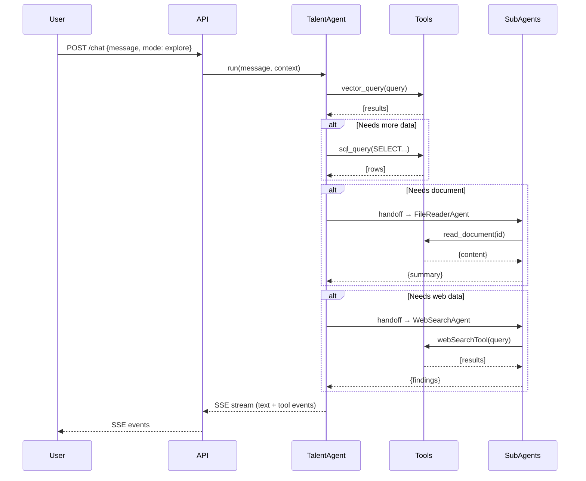
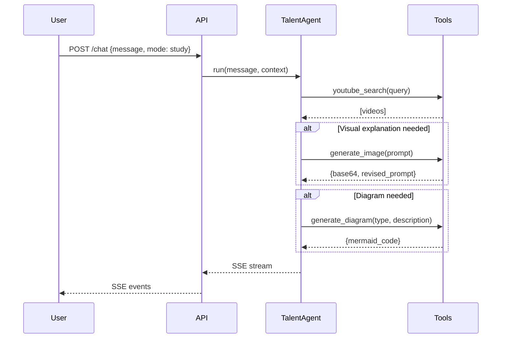
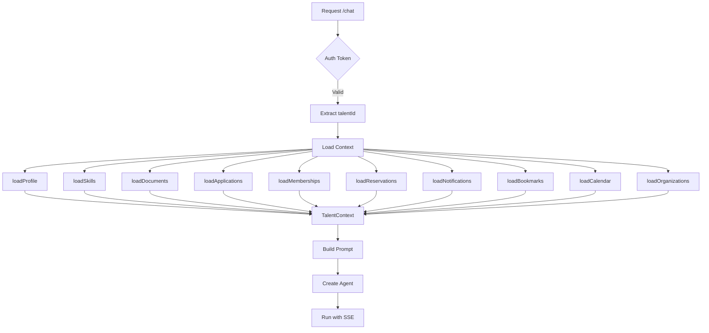

# Copilot Agent Architecture — Documentation Technique Complète

> Version: 1.0.0 | Dernière mise à jour: Février 2026

---

## Table des Matières

1. [Vue d'ensemble](#1-vue-densemble)
2. [Agents](#2-agents)
3. [Prompts Système](#3-prompts-système)
4. [Tools (Outils)](#4-tools-outils)
5. [Handoffs (Délégation)](#5-handoffs-délégation)
6. [Context Structure](#6-context-structure)
7. [SSE Streaming](#7-sse-streaming)
8. [Configuration & Limites](#8-configuration--limites)
9. [Sécurité](#9-sécurité)
10. [Diagrammes](#10-diagrammes)

---

## 1. Vue d'ensemble

### Architecture Globale

```
┌─────────────────────────────────────────────────────────────────────────────┐
│                          COPILOT ARCHITECTURE                               │
├─────────────────────────────────────────────────────────────────────────────┤
│                                                                             │
│  ┌───────────────────┐  ┌───────────────────┐  ┌───────────────────┐       │
│  │   TalentAgent     │  │   TalentAgent     │  │     OrgAgent      │       │
│  │    (explore)      │  │     (study)       │  │   (organization)  │       │
│  │    gpt-4.1        │  │     gpt-4.1       │  │     gpt-4.1       │       │
│  └─────────┬─────────┘  └─────────┬─────────┘  └─────────┬─────────┘       │
│            │                      │                      │                  │
│            └──────────────────────┼──────────────────────┘                  │
│                                   │                                         │
│                          ┌────────┴────────┐                                │
│                          │     TOOLS       │                                │
│                          ├─────────────────┤                                │
│                          │ • vector_query  │ ← Pinecone (discovery)        │
│                          │ • sql_query     │ ← PostgreSQL (personal data)  │
│                          │ • youtube_search│ ← YouTube Data API            │
│                          │ • generate_doc  │ ← GPT-4.1 (markdown)          │
│                          │ • generate_image│ ← gpt-image-1 (base64)        │
│                          │ • generate_diag │ ← GPT-4.1 (Mermaid)           │
│                          └────────┬────────┘                                │
│                                   │                                         │
│                          ┌────────┴────────┐                                │
│                          │    HANDOFFS     │                                │
│                          ├─────────────────┤                                │
│                          │ • FileReader    │ ← gpt-4.1-mini (documents)    │
│                          │ • WebSearch     │ ← gpt-4.1-mini (web)          │
│                          └─────────────────┘                                │
│                                                                             │
└─────────────────────────────────────────────────────────────────────────────┘
```

### Stack Technologique

| Composant | Technologie |
|-----------|-------------|
| Framework Agent | OpenAI Agents SDK (`@openai/agents`) |
| Modèle Principal | GPT-4.1 (1M tokens context) |
| Modèle Sub-agents | GPT-4.1-mini (1M tokens context) |
| Génération Images | gpt-image-1 |
| Vector Search | Pinecone |
| Base de Données | PostgreSQL |
| Streaming | Server-Sent Events (SSE) |
| Validation | Zod v4.3.5 |

---

## 2. Agents

### 2.1 TalentAgent (Mode Explore)

**Fichier:** `src/services/copilot/agents/talent.agent.ts`

| Propriété | Valeur |
|-----------|--------|
| **Nom** | `Talent Agent (explore)` |
| **Modèle** | `gpt-4.1` |
| **Max Tokens** | Non spécifié (défaut SDK) |
| **Temperature** | Non spécifié (défaut SDK) |
| **Description** | Agent principal pour l'exploration de la plateforme : recherche d'opportunités, communautés, espaces, talents |

**Tools disponibles:**
| Tool | Description |
|------|-------------|
| `vector_query` | Recherche sémantique Pinecone |
| `sql_query` | Requêtes PostgreSQL (IDOR protégé) |
| `generate_document` | Génération de documents markdown |

**Handoffs:**
| Agent | Description |
|-------|-------------|
| `FileReaderAgent` | Lecture des documents du talent |
| `WebSearchAgent` | Recherche web externe |

```typescript
// Création de l'agent (simplifié)
return new Agent({
  name: `Talent Agent (explore)`,
  model: 'gpt-4.1',
  instructions: buildTalentExplorerPrompt(context),
  tools: [vectorQueryTool, secureSqlTool, generateDocumentTool],
  handoffs: [handoff(createFileReaderAgent(context.talentId)), handoff(webSearchAgent)],
});
```

---

### 2.2 TalentAgent (Mode Study)

**Fichier:** `src/services/copilot/agents/talent.agent.ts`

| Propriété | Valeur |
|-----------|--------|
| **Nom** | `Talent Agent (study)` |
| **Modèle** | `gpt-4.1` |
| **Max Tokens** | Non spécifié (défaut SDK) |
| **Temperature** | Non spécifié (défaut SDK) |
| **Description** | Agent pédagogique pour l'apprentissage : recherche YouTube, génération de visuels et diagrammes |

**Tools disponibles:**
| Tool | Description |
|------|-------------|
| `sql_query` | Requêtes PostgreSQL (scope restreint) |
| `youtube_search` | Recherche de vidéos éducatives |
| `generate_image` | Génération d'images pédagogiques |
| `generate_diagram` | Génération de diagrammes Mermaid |

**Handoffs:**
| Agent | Description |
|-------|-------------|
| `FileReaderAgent` | Lecture des documents du talent |
| `WebSearchAgent` | Recherche web externe |

**Restrictions Mode Study:**
- Pas d'accès à `vector_query` (pas d'exploration plateforme)
- Pas d'accès à `generate_document`
- Focus uniquement sur l'apprentissage et la création de contenu pédagogique

---

### 2.3 OrgAgent (Organization Explorer)

**Fichier:** `src/services/copilot/agents/organization.agent.ts`

| Propriété | Valeur |
|-----------|--------|
| **Nom** | `Organization Explorer` |
| **Modèle** | `gpt-4.1` |
| **Max Tokens** | Non spécifié (défaut SDK) |
| **Temperature** | Non spécifié (défaut SDK) |
| **Description** | Agent de gestion d'organisation : gestion des membres, candidatures, analytics |

**Tools disponibles:**
| Tool | Description |
|------|-------------|
| `vector_query` | Recherche de talents/compétences |
| `sql_query` | Données organisation (IDOR protégé) |
| `generate_document` | Génération de rapports/documents |

**Handoffs:**
| Agent | Description |
|-------|-------------|
| `FileReaderAgent` | Lecture des documents |
| `WebSearchAgent` | Recherche web externe |

```typescript
// Création de l'agent (simplifié)
return new Agent({
  name: 'Organization Explorer',
  model: 'gpt-4.1',
  instructions: buildOrgExplorerPrompt(context),
  tools: [vectorQueryTool, secureSqlTool, generateDocumentTool],
  handoffs: [handoff(createFileReaderAgent(context.talentId)), handoff(webSearchAgent)],
});
```

---

### 2.4 FileReaderAgent (Sub-agent)

**Fichier:** `src/services/copilot/tools/file-read.tool.ts`

| Propriété | Valeur |
|-----------|--------|
| **Nom** | `FileReaderAgent` |
| **Modèle** | `gpt-4.1-mini` |
| **Max Tokens** | Non spécifié (défaut SDK) |
| **Temperature** | Non spécifié (défaut SDK) |
| **Description** | Sub-agent pour la lecture et l'analyse des documents du talent (CV, diplômes, etc.) |

**Tools disponibles:**
| Tool | Description |
|------|-------------|
| `read_document` | Lecture du contenu d'un document (IDOR protégé) |

**Prompt système:**
```
You are a document reading assistant. Your job is to:
1. Read the content of documents using the read_document tool
2. Extract and summarize relevant information
3. Answer questions about the document content

Always use the read_document tool when asked about document contents.
Respond in the same language as the user's question.
```

**Sécurité:** Factory pattern avec injection de `talentId` pour protection IDOR.

---

### 2.5 WebSearchAgent (Sub-agent)

**Fichier:** `src/services/copilot/tools/web-search.tool.ts`

| Propriété | Valeur |
|-----------|--------|
| **Nom** | `WebSearchAgent` |
| **Modèle** | `gpt-4.1-mini` |
| **Max Tokens** | Non spécifié (défaut SDK) |
| **Temperature** | Non spécifié (défaut SDK) |
| **Description** | Sub-agent pour la recherche d'informations sur le web |

**Tools disponibles:**
| Tool | Description |
|------|-------------|
| `webSearchTool()` | Outil natif OpenAI de recherche web |

**Prompt système:**
```
You are a web research assistant. Your job is to:
1. Search the web for relevant information using the web search tool
2. Summarize findings clearly and concisely
3. Cite sources when possible

Only search for information that is:
- Professional and educational
- Related to careers, skills, or learning
- Safe for work

Respond in the same language as the user's question.
```

---

## 3. Prompts Système

### 3.1 Structure des Prompts (GPT-4.1 Optimized)

Tous les prompts suivent la structure optimisée pour GPT-4.1 :

```
1. ROLE            → Définition claire du rôle
2. INSTRUCTIONS    → Instructions explicites et détaillées
3. TOOL SEQUENCING → Ordre d'utilisation des tools
4. OUTPUT FORMAT   → Format de réponse attendu
5. ONTOLOGY        → Injection de l'ontologie plateforme
6. CONTEXT         → Données utilisateur injectées
7. FINAL REMINDER  → Instructions critiques répétées
```

### 3.2 Talent Explorer Prompt

**Fichier:** `src/services/copilot/prompts/talent-explorer.prompt.ts`

**Structure complète:**

```typescript
export function buildTalentExplorerPrompt(context: TalentContext): string {
  const languageInstructions = getLanguageInstructions(context.language);
  const ontology = getOntology();

  return `
# ROLE
You are Étu, the intelligent copilot of Etudesk...

# AGENTIC BEHAVIOR (CRITICAL)
1. PERSISTENCE: If initial approach fails, try alternatives...
2. TOOL-CALLING: Use tools proactively...
3. PLANNING: Think step-by-step...

# TOOL SEQUENCING (MANDATORY ORDER)
1. vector_query FIRST - Always start with semantic search...
2. sql_query SECOND - For personal data or precise filters...
3. file_read - When user asks about their documents...
4. web_search ONLY IF - Internal data is insufficient...

# OUTPUT FORMAT
${languageInstructions}

## Entity Cards (CRITICAL)
\`\`\`entity:opportunity
{"id": "uuid", "title": "...", "organization": "...", ...}
\`\`\`

# ONTOLOGY
${ontology}

# USER CONTEXT
Profile: ${JSON.stringify(context.profile)}
Skills: ${context.skills?.map(s => s.name).join(', ')}
...

# FINAL REMINDER
- NEVER fabricate entity IDs
- Always verify data with tools before responding
`;
}
```

**Instructions de langue:**
```typescript
function getLanguageInstructions(language?: 'fr' | 'en'): string {
  if (language === 'en') {
    return 'Always respond in clear, professional English.';
  }
  return 'Always respond in the most refined French. Use "tu" for informal, friendly tone.';
}
```

---

### 3.3 Talent Study Prompt

**Fichier:** `src/services/copilot/prompts/talent-study.prompt.ts`

**Spécificités:**
- Injection du bloc `skills` avec compétences à développer
- Protocole pédagogique obligatoire
- `youtube_search` OBLIGATOIRE pour chaque réponse éducative
- Pas d'accès aux données plateforme (opportunités, communautés, espaces)

```typescript
export function buildTalentStudyPrompt(context: TalentContext): string {
  const skillsBlock = buildSkillsBlock(context.skills);

  return `
# ROLE
You are Étu in STUDY MODE - a dedicated learning companion...

# TEACHING PROTOCOL (MANDATORY)
1. ALWAYS use youtube_search to find relevant educational videos
2. Structure explanations with clear headers
3. Use generate_image for visual concepts
4. Use generate_diagram for processes and relationships

# SKILLS TO DEVELOP
${skillsBlock}

# TOOL USAGE
- sql_query: ONLY for user's learning history and preferences
- youtube_search: MANDATORY for every educational response
- generate_image: For visual explanations
- generate_diagram: For flowcharts and relationships

# RESTRICTIONS
- NO access to opportunities, communities, or spaces
- Focus ONLY on learning and skill development
`;
}
```

---

### 3.4 Organization Explorer Prompt

**Fichier:** `src/services/copilot/prompts/org-explorer.prompt.ts`

**Spécificités:**
- `sql_query` FIRST pour les données organisation
- Contexte organisation injecté
- Accès aux analytics et gestion des membres

```typescript
export function buildOrgExplorerPrompt(context: OrgContext): string {
  return `
# ROLE
You are Étu, the intelligent assistant for organization management...

# TOOL SEQUENCING
1. sql_query FIRST - Organization data is structured...
2. vector_query - For talent/skill discovery...
3. generate_document - For reports and summaries...

# ORGANIZATION CONTEXT
Organization: ${context.organization.name}
Sector: ${context.organization.sectors?.join(', ')}
Members: ${context.memberCount}
Active Opportunities: ${context.activeOpportunities}

# CAPABILITIES
- Manage organization members
- Review applications
- Generate reports
- Search for talents matching criteria
`;
}
```

---

## 4. Tools (Outils)

### 4.1 vector_query

**Fichier:** `src/services/copilot/tools/vector-query.tool.ts`

| Propriété | Valeur |
|-----------|--------|
| **Nom** | `vector_query` |
| **Description** | Recherche sémantique dans Pinecone |
| **Disponible dans** | Explore, Organization |

**Paramètres:**
```typescript
{
  query: string;           // Texte de recherche
  entity_type: 'talent' | 'opportunity' | 'community' | 'space';
  filters?: Record<string, unknown>;  // Filtres metadata Pinecone
  top_k?: number;          // Nombre de résultats (défaut: 10)
}
```

**Implémentation:**
```typescript
export const vectorQueryTool = tool({
  name: 'vector_query',
  description: 'Search for entities using semantic similarity...',
  parameters: z.object({
    query: z.string().describe('Search query'),
    entity_type: z.enum(['talent', 'opportunity', 'community', 'space']),
    filters: z.record(z.string(), z.unknown()).optional(),
    top_k: z.number().optional().default(10),
  }),
  execute: async ({ query, entity_type, filters, top_k }) => {
    const sanitizedFilters = sanitizeFilters(filters);
    const results = await pinecone.query({
      namespace: entity_type,
      vector: await embed(query),
      filter: sanitizedFilters,
      topK: top_k,
      includeMetadata: true,
    });
    return results.matches;
  },
});
```

**Sécurité:** `sanitizeFilters()` supprime les valeurs non-scalaires.

---

### 4.2 sql_query

**Fichier:** `src/services/copilot/tools/sql-query.tool.ts`

| Propriété | Valeur |
|-----------|--------|
| **Nom** | `sql_query` |
| **Description** | Requêtes PostgreSQL sécurisées |
| **Disponible dans** | Explore, Study, Organization |

**Paramètres:**
```typescript
{
  query: string;  // Requête SQL SELECT uniquement
}
```

**Factory Pattern (IDOR Protection):**
```typescript
export function createSqlQueryTool(authenticatedTalentId: string) {
  return tool({
    name: 'sql_query',
    description: 'Execute read-only SQL queries...',
    parameters: z.object({
      query: z.string().describe('SELECT query only'),
    }),
    execute: async ({ query }) => {
      // Validation: SELECT only
      if (!query.trim().toLowerCase().startsWith('select')) {
        throw new Error('Only SELECT queries allowed');
      }

      // Injection automatique du talentId pour filtrage
      const secureQuery = injectTalentIdFilter(query, authenticatedTalentId);

      const result = await pool.query(secureQuery);
      return result.rows;
    },
  });
}
```

**Tables accessibles:** `talents`, `talent_skills`, `talent_documents`, `opportunity_applications`, `community_memberships`, `space_bookings`, `notifications`, `bookmarks`, etc.

---

### 4.3 youtube_search

**Fichier:** `src/services/copilot/tools/youtube-search.tool.ts`

| Propriété | Valeur |
|-----------|--------|
| **Nom** | `youtube_search` |
| **Description** | Recherche de vidéos éducatives YouTube |
| **Disponible dans** | Study |

**Paramètres:**
```typescript
{
  query: string;      // Requête de recherche
  max_results?: number;  // Nombre de résultats (défaut: 5, max: 10)
}
```

**Retour:**
```typescript
{
  videos: Array<{
    id: string;
    title: string;
    description: string;
    thumbnail: string;
    channelTitle: string;
    publishedAt: string;
    url: string;
  }>;
}
```

---

### 4.4 generate_document

**Fichier:** `src/services/copilot/tools/generate-document.tool.ts`

| Propriété | Valeur |
|-----------|--------|
| **Nom** | `generate_document` |
| **Description** | Génération de documents markdown structurés |
| **Disponible dans** | Explore, Organization |

**Paramètres:**
```typescript
{
  type: 'cv' | 'cover_letter' | 'report' | 'summary';
  context: string;    // Instructions de génération
  format?: 'markdown' | 'plain';
}
```

**Modèle utilisé:** GPT-4.1 (via appel API interne)

---

### 4.5 generate_image

**Fichier:** `src/services/copilot/tools/generate-image.tool.ts`

| Propriété | Valeur |
|-----------|--------|
| **Nom** | `generate_image` |
| **Description** | Génération d'images pédagogiques |
| **Disponible dans** | Study |
| **Modèle** | `gpt-image-1` |

**Paramètres:**
```typescript
{
  prompt: string;     // Description de l'image
  size?: '1024x1024' | '1536x1024' | '1024x1536';
  style?: 'natural' | 'vivid';
}
```

**Retour:**
```typescript
{
  image_base64: string;  // Image en base64 (PAS une URL)
  revised_prompt: string;
}
```

**Note importante:** `gpt-image-1` retourne du base64, contrairement à DALL-E 3 qui retourne des URLs.

---

### 4.6 generate_diagram

**Fichier:** `src/services/copilot/tools/generate-diagram.tool.ts`

| Propriété | Valeur |
|-----------|--------|
| **Nom** | `generate_diagram` |
| **Description** | Génération de diagrammes Mermaid |
| **Disponible dans** | Study |

**Paramètres:**
```typescript
{
  type: 'flowchart' | 'sequence' | 'class' | 'state' | 'er' | 'gantt' | 'pie';
  description: string;  // Description du diagramme à générer
}
```

**Retour:**
```typescript
{
  mermaid_code: string;  // Code Mermaid valide
  explanation: string;   // Explication du diagramme
}
```

---

## 5. Handoffs (Délégation)

### 5.1 Concept de Handoff

Le SDK OpenAI Agents permet de déléguer des tâches à des sub-agents via `handoff()`. L'agent principal peut transférer le contrôle à un agent spécialisé pour des tâches spécifiques.

```typescript
import { handoff } from '@openai/agents';

// Création du handoff
const fileReaderHandoff = handoff(createFileReaderAgent(talentId));

// Utilisation dans l'agent principal
new Agent({
  // ...
  handoffs: [fileReaderHandoff, handoff(webSearchAgent)],
});
```

### 5.2 FileReaderAgent Handoff

**Déclencheur:** L'utilisateur demande des informations sur ses documents (CV, diplômes, etc.)

**Flow:**
```
TalentAgent → handoff → FileReaderAgent → read_document tool → retour TalentAgent
```

### 5.3 WebSearchAgent Handoff

**Déclencheur:** Les données internes sont insuffisantes et une recherche web est nécessaire.

**Flow:**
```
TalentAgent → handoff → WebSearchAgent → webSearchTool → retour TalentAgent
```

---

## 6. Context Structure

### 6.1 TalentContext (Zod Schema)

**Fichier:** `src/services/copilot/context.ts`

```typescript
const TalentContextSchema = z.object({
  talentId: z.string().uuid(),
  language: z.enum(['fr', 'en']).optional().default('fr'),

  // Profile
  profile: z.object({
    id: z.string().uuid(),
    firstName: z.string(),
    lastName: z.string(),
    email: z.string().email(),
    phone: z.string().optional(),
    bio: z.string().optional(),
    avatarUrl: z.string().optional(),
    location: z.object({
      city: z.string().optional(),
      country: z.string().optional(),
      coordinates: z.tuple([z.number(), z.number()]).optional(),
    }).optional(),
    professionalStatus: z.enum(['student', 'employed', 'freelance', 'unemployed', 'entrepreneur']).optional(),
    experienceYears: z.number().optional(),
    createdAt: z.string(),
  }),

  // Skills
  skills: z.array(z.object({
    id: z.string().uuid(),
    name: z.string(),
    level: z.enum(['beginner', 'intermediate', 'advanced', 'expert']).optional(),
    endorsed: z.boolean().optional(),
  })).optional(),

  // Documents
  documents: z.array(z.object({
    id: z.string().uuid(),
    type: z.enum(['cv', 'diploma', 'certificate', 'portfolio', 'other']),
    originalFilename: z.string(),
    mimeType: z.string(),
    uploadedAt: z.string(),
  })).optional(),

  // Applications
  applications: z.array(z.object({
    id: z.string().uuid(),
    opportunityId: z.string().uuid(),
    opportunityTitle: z.string(),
    organizationName: z.string(),
    status: z.enum(['pending', 'reviewed', 'shortlisted', 'interview', 'accepted', 'rejected']),
    appliedAt: z.string(),
  })).optional(),

  // Memberships
  memberships: z.array(z.object({
    communityId: z.string().uuid(),
    communityName: z.string(),
    role: z.enum(['member', 'moderator', 'admin']),
    joinedAt: z.string(),
  })).optional(),

  // Reservations (Space Bookings)
  reservations: z.array(z.object({
    id: z.string().uuid(),
    spaceId: z.string().uuid(),
    spaceName: z.string(),
    startTime: z.string(),
    endTime: z.string(),
    status: z.enum(['pending', 'confirmed', 'cancelled']),
  })).optional(),

  // Notifications
  notifications: z.array(z.object({
    id: z.string().uuid(),
    type: z.string(),
    title: z.string(),
    message: z.string(),
    read: z.boolean(),
    createdAt: z.string(),
  })).optional(),

  // Bookmarks
  bookmarks: z.array(z.object({
    entityType: z.enum(['opportunity', 'community', 'space', 'talent']),
    entityId: z.string().uuid(),
    entityTitle: z.string(),
    createdAt: z.string(),
  })).optional(),

  // Calendar Events
  calendar: z.array(z.object({
    id: z.string().uuid(),
    title: z.string(),
    type: z.enum(['interview', 'event', 'booking', 'reminder']),
    startTime: z.string(),
    endTime: z.string().optional(),
  })).optional(),

  // Organization Memberships
  organizations: z.array(z.object({
    id: z.string().uuid(),
    name: z.string(),
    role: z.enum(['owner', 'admin', 'member']),
  })).optional(),
});
```

### 6.2 Context Loaders

**Fichier:** `src/services/copilot/context.ts`

| Loader | Description | Requête SQL |
|--------|-------------|-------------|
| `loadProfile` | Profil utilisateur | `SELECT * FROM talents WHERE id = $1` |
| `loadDocuments` | Documents du talent | `SELECT * FROM talent_documents WHERE talent_id = $1` |
| `loadApplications` | Candidatures | `SELECT * FROM opportunity_applications WHERE talent_id = $1` |
| `loadMemberships` | Communautés rejointes | `SELECT * FROM community_memberships WHERE talent_id = $1` |
| `loadReservations` | Réservations espaces | `SELECT * FROM space_bookings WHERE talent_id = $1` |
| `loadNotifications` | Notifications non lues | `SELECT * FROM notifications WHERE talent_id = $1 AND read = false` |
| `loadBookmarks` | Favoris | `SELECT * FROM bookmarks WHERE talent_id = $1` |
| `loadCalendar` | Événements à venir | Multiple sources (interviews, events, bookings) |
| `loadOrganizations` | Organisations du talent | `SELECT * FROM organization_members WHERE talent_id = $1` |

### 6.3 EXPLORER_CONTEXT_OPTIONS

Options optimisées pour le mode Explore :

```typescript
export const EXPLORER_CONTEXT_OPTIONS = {
  includeDocuments: true,
  includeApplications: true,
  includeMemberships: true,
  includeReservations: true,
  includeNotifications: true,  // Limité aux 10 dernières
  includeBookmarks: true,
  includeCalendar: true,
  includeOrganizations: true,
};
```

---

## 7. SSE Streaming

### 7.1 Configuration

**Fichier:** `src/services/copilot/stream/sse.handler.ts`

| Paramètre | Valeur | Description |
|-----------|--------|-------------|
| `MAX_TOOL_CALLS` | 12 | Nombre maximum d'appels tools par turn |
| `MAX_TURN_DURATION_MS` | 120,000 | Timeout de 2 minutes par turn |

### 7.2 Types d'événements SSE

```typescript
// Texte généré progressivement
interface SSETextDeltaEvent {
  type: 'text_delta';
  delta: string;
  timestamp: number;
}

// Début d'appel tool
interface SSEToolStartEvent {
  type: 'tool_called';
  toolName: string;
  toolArgs: Record<string, unknown>;
  timestamp: number;
}

// Fin d'appel tool
interface SSEToolEndEvent {
  type: 'tool_output';
  toolName: string;
  output: unknown;
  timestamp: number;
}

// Fin du stream
interface SSEDoneEvent {
  type: 'done';
  segments: MessageSegment[];
  timestamp: number;
}

// Erreur
interface SSEErrorEvent {
  type: 'error';
  error: string;
  timestamp: number;
}

// Limite atteinte
interface SSELimitReachedEvent {
  type: 'limit_reached';
  reason: 'max_tool_calls' | 'timeout';
  timestamp: number;
}
```

### 7.3 MessageSegment (Persistance)

```typescript
interface MessageSegment {
  order: number;
  type: 'text' | 'tool';
  content?: string;        // Pour type 'text'
  tool?: ToolSegmentData;  // Pour type 'tool'
}

interface ToolSegmentData {
  name: string;
  args: Record<string, unknown>;
  output: unknown;
  duration_ms: number;
}
```

### 7.4 Flow de Streaming

```
1. Client envoie POST /api/copilot/chat avec message
2. Serveur initialise SSE (Content-Type: text/event-stream)
3. Agent SDK run() avec stream: true
4. Pour chaque event:
   - raw_model_stream_event (text delta) → SSETextDeltaEvent
   - run_item_stream_event (tool_called) → SSEToolStartEvent
   - run_item_stream_event (tool_output) → SSEToolEndEvent
5. Fin: SSEDoneEvent avec segments pour persistance
6. Erreur: SSEErrorEvent
7. Limite: SSELimitReachedEvent (max tools ou timeout)
```

---

## 8. Configuration & Limites

### 8.1 Modes Copilot

**Fichier:** `src/services/copilot/session.service.ts`

```typescript
export const COPILOT_MODES = {
  EXPLORE: 'explore',
  STUDY: 'study',
} as const;
```

### 8.2 Limites par Mode

| Mode | Max Tool Calls | Timeout | Handoffs | Vector Query | SQL Query |
|------|----------------|---------|----------|--------------|-----------|
| Explore | 12 | 2 min | ✅ | ✅ | ✅ (full) |
| Study | 12 | 2 min | ✅ | ❌ | ✅ (restreint) |
| Organization | 12 | 2 min | ✅ | ✅ | ✅ (org scope) |

### 8.3 Variables d'environnement

```env
# OpenAI
OPENAI_API_KEY=sk-...

# Pinecone
PINECONE_API_KEY=...
PINECONE_INDEX=etudesk-prod

# YouTube Data API
YOUTUBE_API_KEY=...

# PostgreSQL
DATABASE_URL=postgres://...
```

---

## 9. Sécurité

### 9.1 Protection IDOR (Insecure Direct Object Reference)

**Pattern Factory pour sql_query:**

```typescript
// Le talentId est injecté côté serveur, JAMAIS côté client
export function createSqlQueryTool(authenticatedTalentId: string) {
  return tool({
    execute: async ({ query }) => {
      // Toutes les requêtes sont filtrées par le talent authentifié
      const secureQuery = enforceOwnership(query, authenticatedTalentId);
      // ...
    },
  });
}
```

**Pattern Factory pour read_document:**

```typescript
export function createReadDocumentTool(authenticatedTalentId: string) {
  return tool({
    execute: async ({ documentId }) => {
      // Vérification que le document appartient au talent
      const doc = await db.query(
        'SELECT * FROM talent_documents WHERE id = $1 AND talent_id = $2',
        [documentId, authenticatedTalentId]
      );
      if (!doc.rows[0]) throw new Error('Document not found');
      // ...
    },
  });
}
```

### 9.2 Validation des Filtres Vector Query

```typescript
function sanitizeFilters(filters?: Record<string, unknown>): Record<string, string | number | boolean> {
  if (!filters) return {};

  return Object.fromEntries(
    Object.entries(filters)
      .filter(([_, v]) => ['string', 'number', 'boolean'].includes(typeof v))
  );
}
```

### 9.3 SQL Injection Protection

- Uniquement les requêtes `SELECT` sont autorisées
- Paramètres préparés via `pg` library
- Whitelist de tables accessibles

---

## 10. Diagrammes

### 10.1 Flow Mode Explore



### 10.2 Flow Mode Study



### 10.3 Context Loading Flow



---

## Annexes

### A. Fichiers Source

| Fichier | Description |
|---------|-------------|
| `src/services/copilot/agents/talent.agent.ts` | TalentAgent (explore/study) |
| `src/services/copilot/agents/organization.agent.ts` | OrgAgent |
| `src/services/copilot/tools/vector-query.tool.ts` | Tool vector_query |
| `src/services/copilot/tools/sql-query.tool.ts` | Tool sql_query |
| `src/services/copilot/tools/youtube-search.tool.ts` | Tool youtube_search |
| `src/services/copilot/tools/generate-document.tool.ts` | Tool generate_document |
| `src/services/copilot/tools/generate-image.tool.ts` | Tool generate_image |
| `src/services/copilot/tools/generate-diagram.tool.ts` | Tool generate_diagram |
| `src/services/copilot/tools/file-read.tool.ts` | FileReaderAgent + read_document |
| `src/services/copilot/tools/web-search.tool.ts` | WebSearchAgent |
| `src/services/copilot/prompts/talent-explorer.prompt.ts` | Prompt mode Explore |
| `src/services/copilot/prompts/talent-study.prompt.ts` | Prompt mode Study |
| `src/services/copilot/prompts/org-explorer.prompt.ts` | Prompt Organization |
| `src/services/copilot/context.ts` | Context loaders + Zod schema |
| `src/services/copilot/types.ts` | Types TypeScript |
| `src/services/copilot/stream/sse.handler.ts` | SSE streaming |
| `src/services/copilot/session.service.ts` | Session management |
| `src/services/copilot/ontology.cache.ts` | Ontology caching |
| `src/routes/copilot.ts` | Route handler |

### B. Références

- [OpenAI Agents SDK Documentation](https://platform.openai.com/docs/agents)
- [GPT-4.1 Prompting Guide](https://platform.openai.com/docs/guides/gpt-4-1)
- [gpt-image-1 Documentation](https://platform.openai.com/docs/guides/images)
- [Pinecone Documentation](https://docs.pinecone.io/)

---

> **Maintenu par:** Équipe Etudesk
> **Dernière révision:** Février 2026
