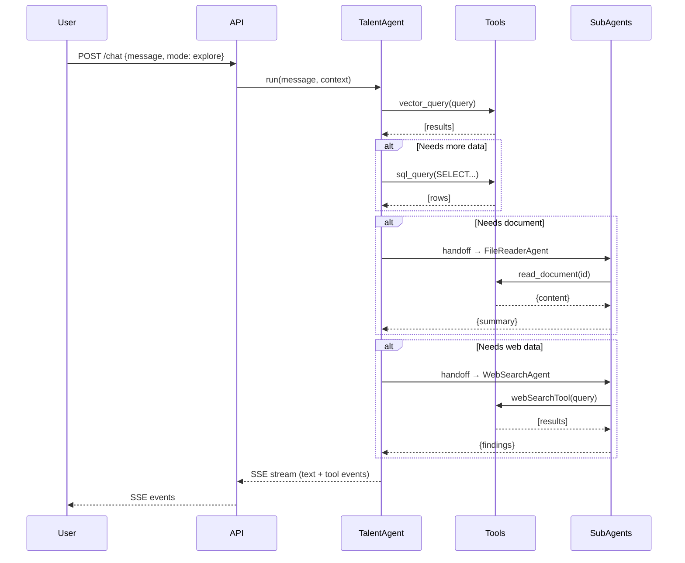
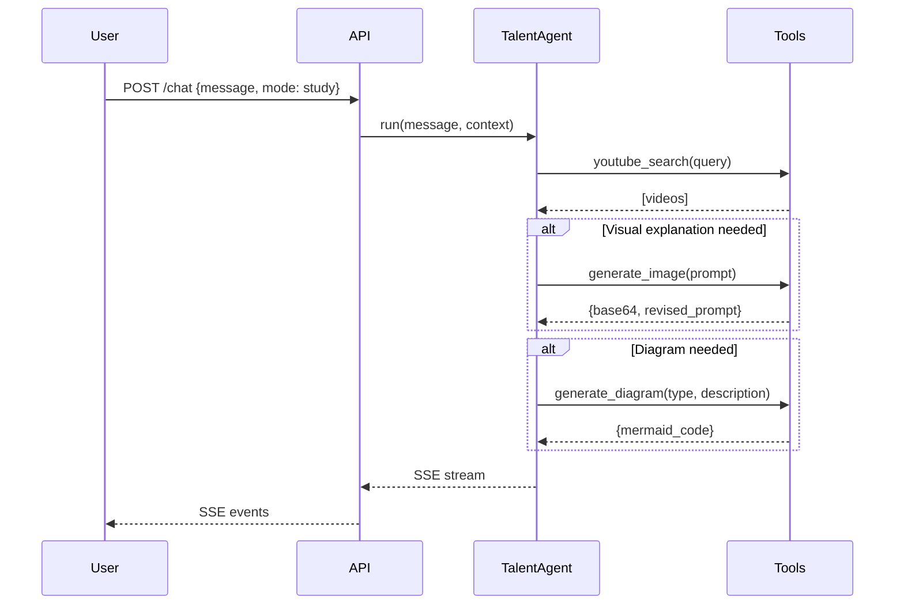
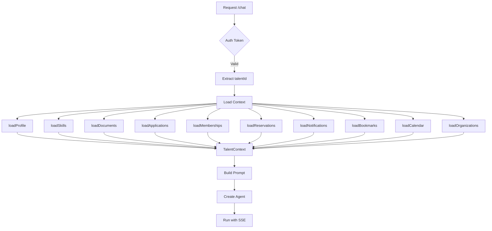

# Copilot Agent Architecture — Documentation Technique Complète

> Version: 1.0.0 | Dernière mise à jour: Février 2026

---

## Table des Matières

1. [Vue d'ensemble](#1-vue-densemble)
2. [Agents](#2-agents)
3. [Prompts Système](#3-prompts-système)
4. [Tools (Outils)](#4-tools-outils)
5. [Handoffs (Délégation)](#5-handoffs-délégation)
6. [Context Structure](#6-context-structure)
7. [SSE Streaming](#7-sse-streaming)
8. [Configuration & Limites](#8-configuration--limites)
9. [Sécurité](#9-sécurité)
10. [Diagrammes](#10-diagrammes)

---

## 1. Vue d'ensemble

### Architecture Globale

```
┌─────────────────────────────────────────────────────────────────────────────┐
│                          COPILOT ARCHITECTURE                               │
├─────────────────────────────────────────────────────────────────────────────┤
│                                                                             │
│  ┌───────────────────┐  ┌───────────────────┐  ┌───────────────────┐       │
│  │   TalentAgent     │  │   TalentAgent     │  │     OrgAgent      │       │
│  │    (explore)      │  │     (study)       │  │   (organization)  │       │
│  │    gpt-5          │  │     gpt-5         │  │     gpt-5         │       │
│  │    6 tools        │  │     7 tools       │  │     5 tools       │       │
│  └─────────┬─────────┘  └─────────┬─────────┘  └─────────┬─────────┘       │
│            │                      │                      │                  │
│            └──────────────────────┼──────────────────────┘                  │
│                                   │                                         │
│         ┌─────────────────────────┴─────────────────────────┐              │
│         │                  9 TOOLS DIRECTS                   │              │
│         ├───────────────────────────────────────────────────┤              │
│         │ • vector_query    ← Pinecone semantic search      │              │
│         │ • sql_query       ← PostgreSQL (intent-based,IDOR)│              │
│         │ • youtube_search  ← YouTube Data API v3           │              │
│         │ • generate_document ← PDF/DOCX/XLS/CSV/TXT       │              │
│         │ • generate_image  ← gpt-image-1 (base64)         │              │
│         │ • generate_diagram ← Mermaid (client-side)        │              │
│         │ • manage_skills   ← PostgreSQL CRUD skills        │              │
│         │ • execute_action  ← PostgreSQL confirmed actions  │              │
│         │ • cv_pdf_generator ← PDFKit (interne)             │              │
│         └─────────────────────┬─────────────────────────────┘              │
│                               │                                             │
│         ┌─────────────────────┴─────────────────────────┐                  │
│         │          2 SUB-AGENTS (via asTool)             │                  │
│         ├───────────────────────────────────────────────┤                  │
│         │ • file_reader  ← gpt-5-mini (documents)       │                  │
│         │ • web_search   ← gpt-5-mini (recherche web)   │                  │
│         └───────────────────────────────────────────────┘                  │
│                                                                             │
│         ┌───────────────────────────────────────────────┐                  │
│         │             GUARDRAILS (gpt-4.1-nano)          │                  │
│         ├───────────────────────────────────────────────┤                  │
│         │ • inputSafetyGuardrail  (parallèle, fail-fast) │                  │
│         │ • outputFormatGuardrail (log-only, no block)   │                  │
│         └───────────────────────────────────────────────┘                  │
│                                                                             │
└─────────────────────────────────────────────────────────────────────────────┘
```

### Stack Technologique

| Composant | Technologie |
|-----------|-------------|
| Framework Agent | OpenAI Agents SDK (`@openai/agents`) |
| Modèle Principal (T1) | GPT-5 (400K tokens context) |
| Modèle Sub-agents (T2) | GPT-5-mini (400K tokens context) |
| Modèle Guardrails (T3) | GPT-4.1-nano (1M tokens context) |
| Génération Images | gpt-image-1 |
| Vector Search | Pinecone |
| Base de Données | PostgreSQL |
| Streaming | Server-Sent Events (SSE) |
| Validation | Zod |

---

## 2. Agents

### 2.1 TalentAgent (Mode Explore)

**Fichier:** `src/services/copilot/agents/talent.agent.ts`

| Propriété | Valeur |
|-----------|--------|
| **Nom** | `Talent Agent (explore)` |
| **Modèle** | `MODEL_T1` (gpt-5) |
| **Guardrails** | inputSafetyGuardrail, outputFormatGuardrail |
| **Description** | Agent principal pour l'exploration de la plateforme : recherche d'opportunités, communautés, espaces, talents |

**Tools disponibles (6):**
| Tool | Type | Description |
|------|------|-------------|
| `vector_query` | Static | Recherche sémantique Pinecone |
| `sql_query` | Factory (IDOR) | Requêtes PostgreSQL intent-based (tous intents my_* + search_*) |
| `generate_document` | Factory (IDOR) | Génération de documents PDF/DOCX/XLS/CSV/TXT |
| `file_reader` | asTool (gpt-5-mini) | Lecture et analyse des documents du talent |
| `web_search` | asTool (gpt-5-mini) | Recherche web externe |
| `execute_action` | Factory (IDOR) | Actions confirmées (apply, join, book, accept/decline) |

```typescript
// Création de l'agent (simplifié)
return new Agent({
  name: `Talent Agent (explore)`,
  model: MODEL_T1,
  instructions: buildTalentExplorerPrompt(context),
  tools: [
    vectorQueryTool,
    secureSqlTool,
    createGenerateDocumentTool(context.profile.id, context.profile.avatarUrl),
    fileReaderTool,       // asTool(), pas handoff()
    webSearchAsTool,      // asTool(), pas handoff()
    createExecuteActionTool(context.profile.id),
  ],
  inputGuardrails: [inputSafetyGuardrail],
  outputGuardrails: [outputFormatGuardrail],
});
```

---

### 2.2 TalentAgent (Mode Study)

**Fichier:** `src/services/copilot/agents/talent.agent.ts`

| Propriété | Valeur |
|-----------|--------|
| **Nom** | `Talent Agent (study)` |
| **Modèle** | `MODEL_T1` (gpt-5) |
| **Guardrails** | inputSafetyGuardrail, outputFormatGuardrail |
| **Description** | Agent pédagogique pour l'apprentissage : recherche YouTube, génération de visuels, évaluation de compétences |

**Tools disponibles (7):**
| Tool | Type | Description |
|------|------|-------------|
| `sql_query` | Factory (IDOR, restreint) | Requêtes PostgreSQL (my_profile, my_skills, my_documents uniquement) |
| `youtube_search` | Static | Recherche de vidéos éducatives YouTube |
| `generate_image` | Static | Génération d'images pédagogiques (gpt-image-1) |
| `generate_diagram` | Static | Génération de diagrammes Mermaid (client-side) |
| `file_reader` | asTool (gpt-5-mini) | Lecture des documents du talent |
| `web_search` | asTool (gpt-5-mini) | Recherche web externe |
| `manage_skills` | Factory (IDOR) | Ajout/mise à jour des compétences talent |

**Restrictions Mode Study:**
- Pas d'accès à `vector_query` (pas d'exploration plateforme)
- Pas d'accès à `generate_document`
- Pas d'accès à `execute_action`
- SQL restreint à 3 intents : `my_profile`, `my_skills`, `my_documents`
- Focus uniquement sur l'apprentissage et la création de contenu pédagogique

---

### 2.3 OrgAgent (Organization Explorer)

**Fichier:** `src/services/copilot/agents/organization.agent.ts`

| Propriété | Valeur |
|-----------|--------|
| **Nom** | `Organization Explorer` |
| **Modèle** | `MODEL_T1` (gpt-5) |
| **Guardrails** | inputSafetyGuardrail, outputFormatGuardrail |
| **Description** | Agent de gestion d'organisation : gestion des membres, candidatures, analytics, création de ressources |

**Tools disponibles (5):**
| Tool | Type | Description |
|------|------|-------------|
| `vector_query` | Static | Recherche de talents/compétences |
| `sql_query` | Factory (IDOR, org scope) | Données organisation (org_* + search_* uniquement) |
| `generate_document` | Factory (IDOR) | Génération de rapports/fiches de poste |
| `web_search` | asTool (gpt-5-mini) | Recherche web (données marché) |
| `execute_action` | Factory (IDOR) | Actions confirmées (publish_opportunity, create_community, create_space via confirmation UI) |

**SQL Intents autorisés (13):**
```
org_members, org_applications, org_stats, org_opportunities,
org_communities, org_spaces, org_revenue, org_invitations,
search_opportunities, search_communities, search_spaces,
search_organizations, search_talents
```

**Restrictions Mode Org:**
- PAS d'accès à `file_reader` (pas de lecture de documents personnels)
- PAS d'accès aux intents personnels (my_profile, my_documents, my_skills, etc.)
- PAS d'accès à `youtube_search`, `generate_image`, `generate_diagram`, `manage_skills`

```typescript
// Création de l'agent (simplifié)
return new Agent({
  name: 'Organization Explorer',
  model: MODEL_T1,
  instructions: buildOrgExplorerPrompt(context),
  tools: [
    vectorQueryTool,
    secureSqlTool,  // restricted to ORG_ALLOWED_INTENTS
    createGenerateDocumentTool(context.talentId),
    webSearchAsTool,
    createExecuteActionTool(context.talentId),
  ],
  inputGuardrails: [inputSafetyGuardrail],
  outputGuardrails: [outputFormatGuardrail],
});
```

---

### 2.4 FileReaderAgent (Sub-agent via asTool)

**Fichier:** `src/services/copilot/tools/file-read.tool.ts`

| Propriété | Valeur |
|-----------|--------|
| **Nom** | `FileReaderAgent` |
| **Modèle** | `MODEL_T2` (gpt-5-mini) |
| **Max Tokens** | Non spécifié (défaut SDK) |
| **Temperature** | Non spécifié (défaut SDK) |
| **Description** | Sub-agent pour la lecture et l'analyse des documents du talent (CV, diplômes, etc.) |

**Tools disponibles:**
| Tool | Description |
|------|-------------|
| `read_document` | Lecture du contenu d'un document (IDOR protégé) |

**Prompt système:**
```
You are a document reading assistant. Your job is to:
1. Read the content of documents using the read_document tool
2. Extract and summarize relevant information
3. Answer questions about the document content

Always use the read_document tool when asked about document contents.
Respond in the same language as the user's question.
```

**Sécurité:** Factory pattern avec injection de `talentId` pour protection IDOR.

---

### 2.5 WebSearchAgent (Sub-agent via asTool)

**Fichier:** `src/services/copilot/tools/web-search.tool.ts`

| Propriété | Valeur |
|-----------|--------|
| **Nom** | `WebSearchAgent` |
| **Modèle** | `MODEL_T2` (gpt-5-mini) |
| **Max Tokens** | Non spécifié (défaut SDK) |
| **Temperature** | Non spécifié (défaut SDK) |
| **Description** | Sub-agent pour la recherche d'informations sur le web |

**Tools disponibles:**
| Tool | Description |
|------|-------------|
| `webSearchTool()` | Outil natif OpenAI de recherche web |

**Prompt système:**
```
You are a web research assistant. Your job is to:
1. Search the web for relevant information using the web search tool
2. Summarize findings clearly and concisely
3. Cite sources when possible

Only search for information that is:
- Professional and educational
- Related to careers, skills, or learning
- Safe for work

Respond in the same language as the user's question.
```

---

## 3. Prompts Système

### 3.1 Structure des Prompts (GPT-4.1 Optimized)

Tous les prompts suivent la structure optimisée pour GPT-4.1 :

```
1. ROLE            → Définition claire du rôle
2. INSTRUCTIONS    → Instructions explicites et détaillées
3. TOOL SEQUENCING → Ordre d'utilisation des tools
4. OUTPUT FORMAT   → Format de réponse attendu
5. ONTOLOGY        → Injection de l'ontologie plateforme
6. CONTEXT         → Données utilisateur injectées
7. FINAL REMINDER  → Instructions critiques répétées
```

### 3.2 Talent Explorer Prompt

**Fichier:** `src/services/copilot/prompts/talent-explorer.prompt.ts`

**Structure complète:**

```typescript
export function buildTalentExplorerPrompt(context: TalentContext): string {
  const languageInstructions = getLanguageInstructions(context.language);
  const ontology = getOntology();

  return `
# ROLE
You are Étu, the intelligent copilot of Etudesk...

# AGENTIC BEHAVIOR (CRITICAL)
1. PERSISTENCE: If initial approach fails, try alternatives...
2. TOOL-CALLING: Use tools proactively...
3. PLANNING: Think step-by-step...

# TOOL SEQUENCING (MANDATORY ORDER)
1. vector_query FIRST - Always start with semantic search...
2. sql_query SECOND - For personal data or precise filters...
3. file_read - When user asks about their documents...
4. web_search ONLY IF - Internal data is insufficient...

# OUTPUT FORMAT
${languageInstructions}

## Entity Cards (CRITICAL)
\`\`\`entity:opportunity
{"id": "uuid", "title": "...", "organization": "...", ...}
\`\`\`

# ONTOLOGY
${ontology}

# USER CONTEXT
Profile: ${JSON.stringify(context.profile)}
Skills: ${context.skills?.map(s => s.name).join(', ')}
...

# FINAL REMINDER
- NEVER fabricate entity IDs
- Always verify data with tools before responding
`;
}
```

**Instructions de langue:**
```typescript
function getLanguageInstructions(language?: 'fr' | 'en'): string {
  if (language === 'en') {
    return 'Always respond in clear, professional English.';
  }
  return 'Always respond in the most refined French. Use "tu" for informal, friendly tone.';
}
```

---

### 3.3 Talent Study Prompt

**Fichier:** `src/services/copilot/prompts/talent-study.prompt.ts`

**Spécificités:**
- Injection du bloc `skills` avec compétences à développer
- Protocole pédagogique obligatoire
- `youtube_search` OBLIGATOIRE pour chaque réponse éducative
- Pas d'accès aux données plateforme (opportunités, communautés, espaces)

```typescript
export function buildTalentStudyPrompt(context: TalentContext): string {
  const skillsBlock = buildSkillsBlock(context.skills);

  return `
# ROLE
You are Étu in STUDY MODE - a dedicated learning companion...

# TEACHING PROTOCOL (MANDATORY)
1. ALWAYS use youtube_search to find relevant educational videos
2. Structure explanations with clear headers
3. Use generate_image for visual concepts
4. Use generate_diagram for processes and relationships

# SKILLS TO DEVELOP
${skillsBlock}

# TOOL USAGE
- sql_query: ONLY for user's learning history and preferences
- youtube_search: MANDATORY for every educational response
- generate_image: For visual explanations
- generate_diagram: For flowcharts and relationships

# RESTRICTIONS
- NO access to opportunities, communities, or spaces
- Focus ONLY on learning and skill development
`;
}
```

---

### 3.4 Organization Explorer Prompt

**Fichier:** `src/services/copilot/prompts/org-explorer.prompt.ts`

**Spécificités:**
- `sql_query` FIRST pour les données organisation
- Contexte organisation injecté
- Accès aux analytics et gestion des membres

```typescript
export function buildOrgExplorerPrompt(context: OrgContext): string {
  return `
# ROLE
You are Étu, the intelligent assistant for organization management...

# TOOL SEQUENCING
1. sql_query FIRST - Organization data is structured...
2. vector_query - For talent/skill discovery...
3. generate_document - For reports and summaries...

# ORGANIZATION CONTEXT
Organization: ${context.organization.name}
Sector: ${context.organization.sectors?.join(', ')}
Members: ${context.memberCount}
Active Opportunities: ${context.activeOpportunities}

# CAPABILITIES
- Manage organization members
- Review applications
- Generate reports
- Search for talents matching criteria
`;
}
```

---

## 4. Tools (Outils)

### 4.1 vector_query

**Fichier:** `src/services/copilot/tools/vector-query.tool.ts`

| Propriété | Valeur |
|-----------|--------|
| **Nom** | `vector_query` |
| **Type** | Static (pas de factory) |
| **Description** | Recherche sémantique dans Pinecone |
| **Disponible dans** | Explore, Organization |

**Paramètres:**
```typescript
{
  query: string;           // Texte de recherche en langage naturel
  namespace: 'opportunities' | 'communities' | 'spaces' | 'talents' | 'organizations';
  topK?: number;           // Nombre de résultats (1-30, défaut: 10)
  filtersJson?: string;    // Filtres Pinecone JSON (scalaires uniquement)
}
```

**Sécurité:** `sanitizeFilters()` supprime les valeurs non-scalaires (arrays, objects).

---

### 4.2 sql_query

**Fichier:** `src/services/copilot/tools/sql-query.tool.ts`

| Propriété | Valeur |
|-----------|--------|
| **Nom** | `sql_query` |
| **Type** | Factory (IDOR + scope restriction) |
| **Description** | Requêtes PostgreSQL intent-based |
| **Disponible dans** | Explore (full), Study (restreint), Organization (org scope) |

**Paramètres:**
```typescript
{
  intent: SqlIntent;       // Intent pré-défini (ex: 'my_profile', 'org_stats')
  paramsJson?: string;     // Paramètres JSON optionnels (q, limit, city, etc.)
}
```

**Factory Pattern (IDOR + scope restriction):**
```typescript
export function createSqlQueryTool(
  authenticatedTalentId: string,
  authorizedOrgIds?: string[],
  allowedIntents?: readonly SqlIntent[]
)
```

**21 intents implémentés:**
- **Talent (8):** `my_profile`, `my_applications`, `my_reservations`, `my_invitations`, `my_communities`, `my_bookmarks`, `my_documents`, `my_skills`
- **Org (8):** `org_members`, `org_applications`, `org_stats`, `org_opportunities`, `org_communities`, `org_spaces`, `org_revenue`, `org_invitations`
- **Search (5):** `search_opportunities`, `search_communities`, `search_spaces`, `search_organizations`, `search_talents`

**Sécurité:** Le `talentId` est injecté côté serveur dans CHAQUE requête SQL. Le LLM ne voit jamais les IDs et ne peut pas écrire de SQL arbitraire.

---

### 4.3 youtube_search

**Fichier:** `src/services/copilot/tools/youtube-search.tool.ts`

| Propriété | Valeur |
|-----------|--------|
| **Nom** | `youtube_search` |
| **Type** | Static |
| **Description** | Recherche de vidéos éducatives YouTube |
| **Disponible dans** | Study |

**Paramètres:**
```typescript
{
  query: string;         // Requête de recherche (en français, append "Afrique francophone")
  maxResults?: number;   // Nombre de résultats (1-3, toujours passer 1)
}
```

**Retour:**
```typescript
Array<{
  videoId: string;
  title: string;
  description: string;
  channelName: string;
  thumbnailUrl: string;
}>
```

---

### 4.4 generate_document

**Fichier:** `src/services/copilot/tools/generate-document.tool.ts`

| Propriété | Valeur |
|-----------|--------|
| **Nom** | `generate_document` |
| **Type** | Factory (IDOR) |
| **Description** | Génération multi-format avec auto-save |
| **Disponible dans** | Explore, Organization |

**Paramètres:**
```typescript
{
  format: 'PDF' | 'DOCX' | 'XLS' | 'CSV' | 'TXT';
  title: string;
  contentJson: string;    // JSON structuré (CVData, sections, table)
  instructions: string;   // Instructions de mise en forme
}
```

**Formats de contenu (contentJson):**
1. **CVData** (préféré pour PDF) : `{firstName, lastName, skills[], experiences[], education[], ...}`
2. **Sections** : `{sections: [{heading, body}]}`
3. **Table** : `{headers[], rows[][]}`

**Auto-save :** Le document est automatiquement sauvegardé dans `talent_documents` et déclenche le pipeline d'extraction de compétences.

---

### 4.5 generate_image

**Fichier:** `src/services/copilot/tools/generate-image.tool.ts`

| Propriété | Valeur |
|-----------|--------|
| **Nom** | `generate_image` |
| **Type** | Static |
| **Description** | Génération d'images pédagogiques |
| **Disponible dans** | Study |
| **Modèle** | `gpt-image-1` |

**Paramètres:**
```typescript
{
  prompt: string;     // Description détaillée de l'image
  size?: '1024x1024' | '1536x1024' | '1024x1536';
  quality?: 'low' | 'medium' | 'high';
}
```

**Retour:** Image base64 + URL de stockage persistant.

**Note importante:** `gpt-image-1` retourne du base64, PAS des URLs comme DALL-E 3.

---

### 4.6 generate_diagram

**Fichier:** `src/services/copilot/tools/generate-diagram.tool.ts`

| Propriété | Valeur |
|-----------|--------|
| **Nom** | `generate_diagram` |
| **Type** | Static |
| **Description** | Génération de diagrammes Mermaid (rendu client) |
| **Disponible dans** | Study |

**Paramètres:**
```typescript
{
  title: string;          // Titre du diagramme
  diagramType: 'flowchart' | 'sequenceDiagram' | 'classDiagram' | 'mindmap' | 'timeline' | 'gantt' | 'pie' | 'erDiagram';
  mermaidCode: string;    // Code Mermaid valide
}
```

**Sécurité:** Sanitize `<br/>` → `\n`, escape parenthèses `(` → `&#40;`, validation type ↔ prefix.

---

### 4.7 manage_skills

**Fichier:** `src/services/copilot/tools/manage-skills.tool.ts`

| Propriété | Valeur |
|-----------|--------|
| **Nom** | `manage_skills` |
| **Type** | Factory (IDOR) |
| **Description** | Ajout et mise à jour des compétences talent |
| **Disponible dans** | Study |

**Paramètres:**
```typescript
{
  action: 'add' | 'update';
  skillName: string;
  proficiencyLevel: 'BEGINNER' | 'INTERMEDIATE' | 'ADVANCED' | 'EXPERT';
  origin: 'SELF_DECLARED' | 'AI_INFERRED' | 'DOCUMENT_EXTRACTED' | 'QUIZ_VALIDATED';
}
```

---

### 4.8 execute_action

**Fichier:** `src/services/copilot/tools/execute-action.tool.ts`

| Propriété | Valeur |
|-----------|--------|
| **Nom** | `execute_action` |
| **Type** | Factory (IDOR) |
| **Description** | Exécution d'actions confirmées par l'utilisateur |
| **Disponible dans** | Explore, Organization |

**Paramètres:**
```typescript
{
  action: 'apply_opportunity' | 'join_community' | 'book_space' | 'accept_invitation' | 'decline_invitation';
  entityId: string;       // UUID de l'entité cible
  dataJson?: string;      // Données additionnelles (pour book_space: startDatetime, endDatetime)
}
```

**Protocole :** Le LLM demande TOUJOURS confirmation verbale avant d'appeler ce tool.

---

## 5. Sub-Agents (via asTool)

### 5.1 Pattern asTool (pas de Handoff)

Etudesk utilise `agent.asTool()` du SDK OpenAI Agents pour encapsuler des sub-agents comme des tools ordinaires. Contrairement à `handoff()` qui transfère le contrôle, `asTool()` garde l'agent principal en contrôle — le sub-agent est exécuté comme un tool call.

```typescript
// Création du sub-agent
const fileReaderAgent = createFileReaderAgent(talentId);

// Encapsulation comme tool (PAS handoff)
const fileReaderTool = fileReaderAgent.asTool({
  toolName: 'file_reader',
  toolDescription: 'Read and analyze talent documents',
});

// Utilisation dans l'agent principal
new Agent({
  tools: [fileReaderTool, webSearchAsTool, ...otherTools],
  // PAS de handoffs: []
});
```

### 5.2 FileReaderAgent (asTool)

**Disponible dans:** Explore, Study (PAS Org)
**Déclencheur:** L'utilisateur demande des informations sur ses documents (CV, diplômes, etc.)

**Flow:**
```
TalentAgent → tool call file_reader → FileReaderAgent → read_document → résultat retourné → TalentAgent continue
```

### 5.3 WebSearchAgent (asTool)

**Disponible dans:** Explore, Study, Org
**Déclencheur:** Les données internes sont insuffisantes et une recherche web est nécessaire.

**Flow:**
```
TalentAgent/OrgAgent → tool call web_search → WebSearchAgent → webSearchTool → résultat retourné → Agent continue
```

---

## 6. Context Structure

### 6.1 TalentContext (Zod Schema)

**Fichier:** `src/services/copilot/context.ts`

```typescript
const TalentContextSchema = z.object({
  talentId: z.string().uuid(),
  language: z.enum(['fr', 'en']).optional().default('fr'),

  // Profile
  profile: z.object({
    id: z.string().uuid(),
    firstName: z.string(),
    lastName: z.string(),
    email: z.string().email(),
    phone: z.string().optional(),
    bio: z.string().optional(),
    avatarUrl: z.string().optional(),
    location: z.object({
      city: z.string().optional(),
      country: z.string().optional(),
      coordinates: z.tuple([z.number(), z.number()]).optional(),
    }).optional(),
    professionalStatus: z.enum(['student', 'employed', 'freelance', 'unemployed', 'entrepreneur']).optional(),
    experienceYears: z.number().optional(),
    createdAt: z.string(),
  }),

  // Skills
  skills: z.array(z.object({
    id: z.string().uuid(),
    name: z.string(),
    level: z.enum(['beginner', 'intermediate', 'advanced', 'expert']).optional(),
    endorsed: z.boolean().optional(),
  })).optional(),

  // Documents
  documents: z.array(z.object({
    id: z.string().uuid(),
    type: z.enum(['cv', 'diploma', 'certificate', 'portfolio', 'other']),
    originalFilename: z.string(),
    mimeType: z.string(),
    uploadedAt: z.string(),
  })).optional(),

  // Applications
  applications: z.array(z.object({
    id: z.string().uuid(),
    opportunityId: z.string().uuid(),
    opportunityTitle: z.string(),
    organizationName: z.string(),
    status: z.enum(['pending', 'reviewed', 'shortlisted', 'interview', 'accepted', 'rejected']),
    appliedAt: z.string(),
  })).optional(),

  // Memberships
  memberships: z.array(z.object({
    communityId: z.string().uuid(),
    communityName: z.string(),
    role: z.enum(['member', 'moderator', 'admin']),
    joinedAt: z.string(),
  })).optional(),

  // Reservations (Space Bookings)
  reservations: z.array(z.object({
    id: z.string().uuid(),
    spaceId: z.string().uuid(),
    spaceName: z.string(),
    startTime: z.string(),
    endTime: z.string(),
    status: z.enum(['pending', 'confirmed', 'cancelled']),
  })).optional(),

  // Notifications
  notifications: z.array(z.object({
    id: z.string().uuid(),
    type: z.string(),
    title: z.string(),
    message: z.string(),
    read: z.boolean(),
    createdAt: z.string(),
  })).optional(),

  // Bookmarks
  bookmarks: z.array(z.object({
    entityType: z.enum(['opportunity', 'community', 'space', 'talent']),
    entityId: z.string().uuid(),
    entityTitle: z.string(),
    createdAt: z.string(),
  })).optional(),

  // Calendar Events
  calendar: z.array(z.object({
    id: z.string().uuid(),
    title: z.string(),
    type: z.enum(['interview', 'event', 'booking', 'reminder']),
    startTime: z.string(),
    endTime: z.string().optional(),
  })).optional(),

  // Organization Memberships
  organizations: z.array(z.object({
    id: z.string().uuid(),
    name: z.string(),
    role: z.enum(['owner', 'admin', 'member']),
  })).optional(),
});
```

### 6.2 Context Loaders

**Fichier:** `src/services/copilot/context.ts`

| Loader | Description | Requête SQL |
|--------|-------------|-------------|
| `loadProfile` | Profil utilisateur | `SELECT * FROM talents WHERE id = $1` |
| `loadDocuments` | Documents du talent | `SELECT * FROM talent_documents WHERE talent_id = $1` |
| `loadApplications` | Candidatures | `SELECT * FROM opportunity_applications WHERE talent_id = $1` |
| `loadMemberships` | Communautés rejointes | `SELECT * FROM community_memberships WHERE talent_id = $1` |
| `loadReservations` | Réservations espaces | `SELECT * FROM space_bookings WHERE talent_id = $1` |
| `loadNotifications` | Notifications non lues | `SELECT * FROM notifications WHERE talent_id = $1 AND read = false` |
| `loadBookmarks` | Favoris | `SELECT * FROM bookmarks WHERE talent_id = $1` |
| `loadCalendar` | Événements à venir | Multiple sources (interviews, events, bookings) |
| `loadOrganizations` | Organisations du talent | `SELECT * FROM organization_members WHERE talent_id = $1` |

### 6.3 EXPLORER_CONTEXT_OPTIONS

Options optimisées pour le mode Explore :

```typescript
export const EXPLORER_CONTEXT_OPTIONS = {
  includeDocuments: true,
  includeApplications: true,
  includeMemberships: true,
  includeReservations: true,
  includeNotifications: true,  // Limité aux 10 dernières
  includeBookmarks: true,
  includeCalendar: true,
  includeOrganizations: true,
};
```

---

## 7. SSE Streaming

### 7.1 Configuration

**Fichier:** `src/services/copilot/stream/sse.handler.ts`

| Paramètre | Valeur | Description |
|-----------|--------|-------------|
| `MAX_TOOL_CALLS` | 12 | Nombre maximum d'appels tools par turn |
| `MAX_TURN_DURATION_MS` | 120,000 | Timeout de 2 minutes par turn |

### 7.2 Types d'événements SSE

```typescript
// Texte généré progressivement
interface SSETextDeltaEvent {
  type: 'text_delta';
  delta: string;
}

// Début d'appel tool
interface SSEToolStartEvent {
  type: 'tool_start';
  tool: {
    callId: string;
    name: string;
    args?: Record<string, unknown>;
  };
}

// Fin d'appel tool
interface SSEToolEndEvent {
  type: 'tool_end';
  tool: {
    callId: string;
    name: string;
    summary?: string;     // Résumé français généré par tool-summary.ts
    result?: unknown;
    duration?: number;
    status: 'success' | 'error';
    error?: string;
  };
}

// Fin du stream
interface SSEDoneEvent {
  type: 'done';
  sessionId: string;
}

// Erreur
interface SSEErrorEvent {
  type: 'error';
  error: string;
}

// Limite atteinte
interface SSELimitReachedEvent {
  type: 'limit_reached';
  reason: 'max_tools' | 'max_duration';
  message: string;
}

// Correction de contenu (output guardrail)
interface SSEContentCorrectedEvent {
  type: 'content_corrected';
  content: string;
}
```

### 7.3 MessageSegment (Persistance)

```typescript
interface MessageSegment {
  type: 'text' | 'tool';
  content?: string;        // Pour type 'text'
  tool?: ToolSegmentData;  // Pour type 'tool'
}

interface ToolSegmentData {
  callId: string;
  name: string;
  args?: Record<string, unknown>;
  result?: unknown;
  summary?: string;        // Résumé français (tool-summary.ts)
  duration?: number;
  status: 'running' | 'success' | 'error';
  error?: string;
}
```

### 7.4 Flow de Streaming

```
1. Client envoie POST /api/copilot/chat avec message
2. Serveur initialise SSE (Content-Type: text/event-stream)
3. Agent SDK run() avec stream: true
4. Pour chaque event:
   - raw_model_stream_event (text delta) → SSETextDeltaEvent
   - run_item_stream_event (tool_called) → SSEToolStartEvent
   - run_item_stream_event (tool_output) → SSEToolEndEvent
5. Fin: SSEDoneEvent avec sessionId
6. Erreur: SSEErrorEvent
7. Limite: SSELimitReachedEvent (max_tools ou max_duration)
8. Correction: SSEContentCorrectedEvent (si output guardrail corrige)
```

---

## 8. Configuration & Limites

### 8.1 Modes Copilot

**Fichier:** `src/services/copilot/session.service.ts`

```typescript
export const COPILOT_MODES = {
  EXPLORE: 'explore',
  STUDY: 'study',
  // ORG mode créé dynamiquement quand organizationId est fourni
} as const;
```

### 8.2 Limites par Mode

| Mode | Max Tool Calls | Timeout | Tools | Vector Query | SQL Query | File Reader |
|------|----------------|---------|-------|--------------|-----------|-------------|
| Explore | 12 | 2 min | 6 | ✅ | ✅ (full) | ✅ (asTool) |
| Study | 12 | 2 min | 7 | ❌ | ✅ (3 intents) | ✅ (asTool) |
| Organization | 12 | 2 min | 5 | ✅ | ✅ (org scope) | ❌ |

### 8.3 Variables d'environnement

```env
# OpenAI
OPENAI_API_KEY=sk-...

# Pinecone
PINECONE_API_KEY=...
PINECONE_INDEX=etudesk-prod

# YouTube Data API
YOUTUBE_API_KEY=...

# PostgreSQL
DATABASE_URL=postgres://...
```

---

## 9. Sécurité

### 9.1 Protection IDOR (Insecure Direct Object Reference)

**6 tools utilisent le pattern Factory (injection côté serveur) :**

| Tool | Factory | Paramètres injectés |
|------|---------|---------------------|
| `sql_query` | `createSqlQueryTool(talentId, orgIds?, allowedIntents?)` | talentId dans CHAQUE requête SQL |
| `generate_document` | `createGenerateDocumentTool(talentId, avatarUrl?)` | talentId pour auto-save |
| `execute_action` | `createExecuteActionTool(talentId)` | talentId pour validation ownership |
| `manage_skills` | `createManageSkillsTool(talentId)` | talentId pour CRUD skills |
| `file_reader` | `createFileReaderTool(talentId)` | talentId pour vérifier ownership document |
| `cv_pdf_generator` | (interne à generate_document) | avatarUrl pour photo CV |

```typescript
// Le talentId est injecté côté serveur, le LLM ne le voit JAMAIS
export function createSqlQueryTool(
  authenticatedTalentId: string,
  authorizedOrgIds?: string[],
  allowedIntents?: readonly SqlIntent[]
) {
  return tool({
    execute: async ({ intent, paramsJson }) => {
      // 1. Vérifier que l'intent est autorisé pour ce mode
      // 2. Injecter talentId/orgIds dans la requête SQL pré-construite
      // 3. Le LLM n'écrit PAS de SQL — il choisit un intent
    },
  });
}
```

### 9.2 Validation des Filtres Vector Query

```typescript
// Supprime arrays, objects — seuls les scalaires passent
function sanitizeFilters(filters?: Record<string, unknown>): Record<string, string | number | boolean> {
  if (!filters) return {};
  return Object.fromEntries(
    Object.entries(filters)
      .filter(([_, v]) => ['string', 'number', 'boolean'].includes(typeof v))
  );
}
```

### 9.3 SQL Injection Protection

- **PAS de SQL arbitraire** — le LLM choisit un `intent` parmi 21 pré-définis
- Requêtes SQL pré-construites côté serveur dans `sql-query.tool.ts`
- Paramètres préparés via `pg` library ($1, $2, ...)
- `talentId` et `orgIds` toujours injectés côté serveur

---

## 10. Diagrammes

### 10.1 Flow Mode Explore



### 10.2 Flow Mode Study



### 10.3 Context Loading Flow



---

## Annexes

### A. Fichiers Source

| Fichier | Description |
|---------|-------------|
| `src/services/copilot/agents/talent.agent.ts` | TalentAgent (explore/study) |
| `src/services/copilot/agents/organization.agent.ts` | OrgAgent |
| `src/services/copilot/tools/vector-query.tool.ts` | Tool vector_query (static) |
| `src/services/copilot/tools/sql-query.tool.ts` | Tool sql_query (factory, 21 intents) |
| `src/services/copilot/tools/youtube-search.tool.ts` | Tool youtube_search (static) |
| `src/services/copilot/tools/generate-document.tool.ts` | Tool generate_document (factory) |
| `src/services/copilot/tools/generate-image.tool.ts` | Tool generate_image (static) |
| `src/services/copilot/tools/generate-diagram.tool.ts` | Tool generate_diagram (static) |
| `src/services/copilot/tools/manage-skills.tool.ts` | Tool manage_skills (factory) |
| `src/services/copilot/tools/execute-action.tool.ts` | Tool execute_action (factory) |
| `src/services/copilot/tools/cv-pdf-generator.ts` | Utilitaire PDF CV (interne) |
| `src/services/copilot/tools/file-read.tool.ts` | FileReaderAgent (asTool, gpt-5-mini) |
| `src/services/copilot/tools/web-search.tool.ts` | WebSearchAgent (asTool, gpt-5-mini) |
| `src/services/copilot/prompts/talent-explorer.prompt.ts` | Prompt mode Explore |
| `src/services/copilot/prompts/talent-study.prompt.ts` | Prompt mode Study |
| `src/services/copilot/prompts/org-explorer.prompt.ts` | Prompt Organization |
| `src/services/copilot/context.ts` | Context loaders |
| `src/services/copilot/context-options.ts` | Options par mode (EXPLORER, STUDY, ORG) |
| `src/services/copilot/types.ts` | Types TypeScript |
| `src/services/copilot/stream/sse.handler.ts` | SSE streaming |
| `src/services/copilot/stream/tool-summary.ts` | Résumés français des tool calls |
| `src/services/copilot/session.service.ts` | Session management |
| `src/services/copilot/session-summarizer.ts` | Summarization historique (gpt-4.1-nano) |
| `src/services/copilot/ontology.cache.ts` | Ontology caching |
| `src/services/copilot/skills/skill.loader.ts` | Chargement des skills par mode |
| `src/services/copilot/guardrails/input.guardrail.ts` | Input safety (gpt-4.1-nano) |
| `src/services/copilot/guardrails/output.guardrail.ts` | Output format validation |
| `src/services/copilot/actions/action.handler.ts` | Confirmation actions (8 actions) |
| `src/services/copilot/actions/action.validators.ts` | Validateurs pre-action |
| `src/services/ai/models.ts` | MODEL_T1/T2/T3 constants |
| `src/routes/copilot.ts` | Route handler |

### B. Références

- [OpenAI Agents SDK Documentation](https://platform.openai.com/docs/agents)
- [GPT-5 Prompting Guide](https://platform.openai.com/docs/guides/gpt-5)
- [gpt-image-1 Documentation](https://platform.openai.com/docs/guides/images)
- [Pinecone Documentation](https://docs.pinecone.io/)
- `docs/COPILOT_TOOLS_DOCUMENTATION.md` — Documentation audit des 11 tools
- `docs/COPILOT_AGENT_PERIMETER.md` — Périmètre exact de chaque agent
- `docs/ontology.md` — Ontologie OWL de la plateforme

---

> **Maintenu par:** Équipe Etudesk
> **Dernière révision:** 9 février 2026 — aligné avec code GPT-5 + asTool pattern
